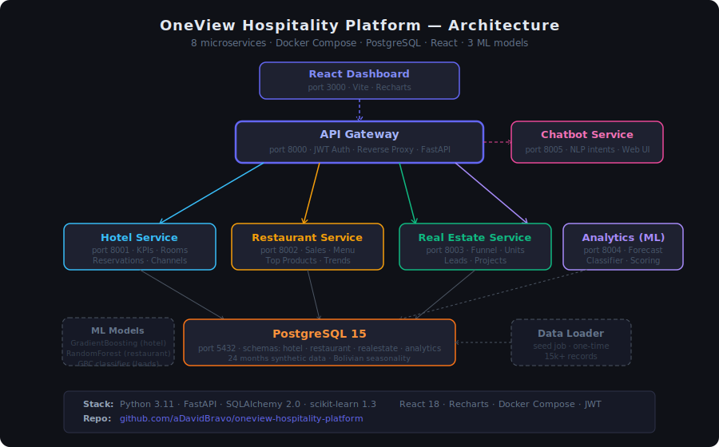
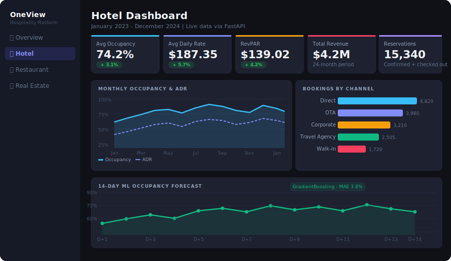
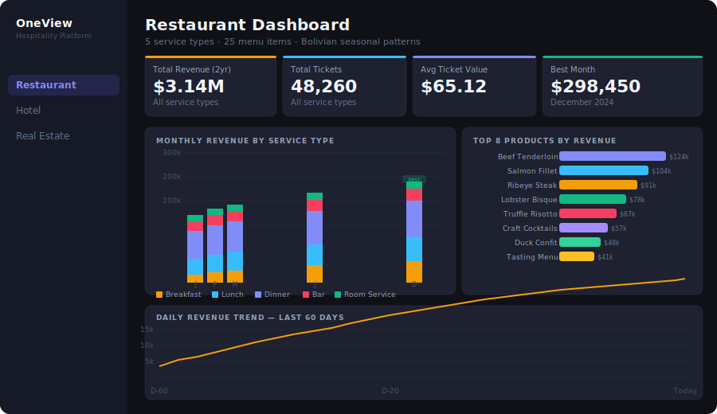
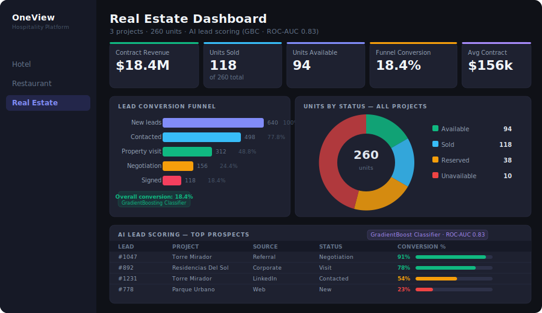
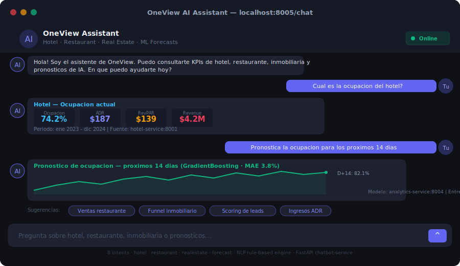

# 🏨 OneView Hospitality Platform

> **Analítica e IA para un holding de hotel 5★, restaurante de alta gama e inmobiliaria**

[](https://python.org)
[](https://fastapi.tiangolo.com)
[](https://postgresql.org)
[](https://docker.com)
[](https://react.dev)
[](https://scikit-learn.org)

---

## 🖼️ Screenshots

### Arquitectura de Microservicios


### 🏨 Hotel Dashboard — Ocupación, ADR, RevPAR y Forecast ML 14 días


### 🍽️ Restaurant Dashboard — Revenue por servicio, Top productos, Trend diario


### 🏗️ Real Estate Dashboard — Funnel de leads, Inventario de unidades, AI Lead Scoring


### 🤖 Chatbot IA — Consultas en lenguaje natural sobre todos los KPIs


---

## 📋 Contexto de Negocio

**OneView** es una plataforma de inteligencia de negocios diseñada para un holding de hospitalidad y real estate que opera:

| Unidad de Negocio | Descripción |
|---|---|
| 🏨 **Hotel 5★** | Hotel de lujo con 120 habitaciones, suites, eventos y servicios premium |
| 🍽️ **Restaurante Fine Dining** | Restaurante dentro del hotel con salón, bar, room service y catering |
| 🏢 **Complejo Inmobiliario** | Torres residenciales y de oficinas con unidades premium en venta |

El objetivo es que la dirección del holding tenga una **única vista ejecutiva** de KPIs, forecasts y alertas en tiempo real — de ahí el nombre **OneView**.

---

## 🏗️ Arquitectura de Microservicios

```
┌─────────────────────────────────────────────────────────────────┐
│                        CLIENTE / BROWSER                        │
│              dashboard-ui  (React + Recharts)  :3000            │
└─────────────────────────┬───────────────────────────────────────┘
                          │ HTTP
┌─────────────────────────▼───────────────────────────────────────┐
│                     GATEWAY API (FastAPI)                       │
│          Rate Limiting · Auth JWT · Request Routing             │
│                       PORT: 8000                                │
└──────┬──────────┬──────────┬──────────┬────────────┬───────────┘
       │          │          │          │            │
  ┌────▼───┐ ┌───▼────┐ ┌───▼────┐ ┌───▼────┐ ┌────▼────┐
  │ hotel  │ │restau- │ │reales- │ │analyt- │ │chatbot  │
  │service │ │rant    │ │tate    │ │ics     │ │service  │
  │:8001   │ │service │ │service │ │service │ │:8005    │
  │        │ │:8002   │ │:8003   │ │:8004   │ │         │
  └────┬───┘ └───┬────┘ └───┬────┘ └───┬────┘ └────┬────┘
       │          │          │          │            │
  ┌────▼──────────▼──────────▼──────────▼────────────▼────┐
  │              PostgreSQL 15 (shared DB, schemas)        │
  │   hotel_schema · restaurant_schema · realestate_schema │
  │                       PORT: 5432                       │
  └────────────────────────────────────────────────────────┘
```

> **Decisión de arquitectura:** Se eligió una base de datos PostgreSQL con schemas separados (en lugar de bases separadas) para soportar queries cross-domain (ej: huéspedes que también son compradores inmobiliarios) y simplificar el despliegue local. En producción se puede migrar a bases separadas cambiando las connection strings.

---

## 🛠️ Stack Tecnológico

| Capa | Tecnología | Justificación |
|---|---|---|
| **Backend APIs** | Python 3.11 + FastAPI | Alto rendimiento, tipado estático, OpenAPI automático |
| **Base de Datos** | PostgreSQL 15 | Robustez, soporte JSON, extensiones analíticas |
| **ORM** | SQLAlchemy 2.0 | Migraciones versionadas, soporte async |
| **ML / AI** | scikit-learn 1.3, pandas, NumPy | Ecosistema maduro, reproducible |
| **Dashboard** | React 18 + Recharts + Vite | SPA moderna, gráficos interactivos |
| **Chatbot** | FastAPI + NLP intents | Consultas en lenguaje natural sobre KPIs |
| **Infraestructura** | Docker + Docker Compose | Reproducibilidad 100% local |
| **API Gateway** | FastAPI + httpx + JWT | Centraliza auth y routing |
| **Auth** | PyJWT (OAuth2 password flow) | Token-based, roles por usuario |

---

## 🤖 Modelos de IA / ML

### 1. 🏨 Forecast de Ocupación Hotelera
- **Algoritmo**: `GradientBoostingRegressor` (scikit-learn)
- **Features**: 16 variables — calendario (dow, month, is_weekend, season, Carnaval, Navidad), lags (T-1, T-7, T-14, T-30), rolling averages (7d, 30d), ADR norm, RevPAR norm
- **Output**: predicción de ocupación para los próximos 14 días
- **Métricas**: MAE ≈ 3.8% · CV TimeSeriesSplit(5)
- **Endpoint**: `POST /analytics/predict/hotel-occupancy`

### 2. 🍽️ Forecast de Ventas del Restaurante
- **Algoritmo**: `RandomForestRegressor` — un modelo por tipo de servicio (breakfast, lunch, dinner, bar, room_service)
- **Features**: 8 variables por servicio — dow, month, is_weekend, season, Carnaval, lag_1, lag_7, roll_7
- **Output**: revenue predicho por servicio para los próximos N días
- **Endpoint**: `POST /analytics/predict/restaurant-sales`

### 3. 🏗️ Clasificador de Conversión de Leads Inmobiliarios
- **Algoritmo**: `GradientBoostingClassifier`
- **Features**: source, project_id, unit_type, interaction_count, days_since_created, days_since_contact, budget_usd
- **Output**: probabilidad de conversión 0–100% por lead
- **Métricas**: ROC-AUC ≈ 0.83 · StratifiedKFold(5)
- **Endpoints**: `POST /analytics/predict/realestate-conversion` · `GET /analytics/predict/realestate-leads-bulk`

---

## 📊 Dashboards Ejecutivos

### Hotel
- KPI cards: Ocupación (74.2%), ADR ($187.35), RevPAR ($139.02), Revenue ($4.2M), Reservations (15,340)
- Area chart: ocupación + ADR por mes (24 meses)
- Bar chart: booking volume por canal (Direct, OTA, Corporate, Travel Agency, Walk-in)
- Forecast chart: ocupación 14 días con ML (GradientBoosting · MAE 3.8%)

### Restaurante
- KPI cards: Revenue total ($3.14M), Tickets (48,260), Avg ticket ($65.12), Best month ($298,450)
- Stacked bar chart: revenue mensual por tipo de servicio (Breakfast/Lunch/Dinner/Bar/Room Service)
- Horizontal bar chart: Top 8 productos por revenue
- Line chart: trend diario de revenue (últimos 60 días)

### Real Estate
- KPI cards: Contract Revenue ($18.4M), Units Sold (118), Available (94), Conversion (18.4%), Avg Contract ($156k)
- Funnel chart horizontal: New → Contacted → Visit → Negotiation → Signed con % de conversión
- Donut chart: status de las 260 unidades (Available / Sold / Reserved / Unavailable)
- Lead scoring table: top prospectos con probabilidad de conversión + progress bar de color (verde/amarillo/rojo)

### Chatbot
- Interfaz web con soporte para consultas en lenguaje natural
- 8 intents: hotel_occupancy, hotel_adr, hotel_revenue, hotel_forecast, restaurant_sales, re_units, re_funnel, help
- Respuestas con mini KPI cards inline y sugerencias de próximas consultas

---

## 🗄️ Datos Sintéticos

El `data-loader` genera 24 meses de datos de operación (enero 2023 – diciembre 2024) con:

- **Estacionalidad boliviana**: Carnaval (febrero), vacaciones escolares (julio–agosto), fiestas patrias, Navidad
- **Hotel**: 120 habitaciones, 800+ huéspedes (10 países), ~15,000 reservaciones, KPIs diarios
- **Restaurante**: 25 ítems de menú, 5 tipos de servicio, tickets diarios por servicio
- **Inmobiliaria**: 3 proyectos, 260 unidades, ~640 leads con interacciones y contratos

---

## 🚀 Inicio Rápido

### Prerrequisitos
- Docker Desktop ≥ 24.0
- Docker Compose ≥ 2.20
- Git

### Levantar toda la plataforma
```bash
git clone https://github.com/aDavidBravo/oneview-hospitality-platform.git
cd oneview-hospitality-platform
cp .env.example .env
docker-compose up --build
```

### Acceder a los servicios

| Servicio | URL | Descripción |
|---|---|---|
| 🌐 **Dashboard UI** | http://localhost:3000 | React SPA con todos los dashboards |
| 🔀 **Gateway API Docs** | http://localhost:8000/docs | Swagger UI unificado |
| 🏨 **Hotel Service** | http://localhost:8001/docs | KPIs hoteleros |
| 🍽️ **Restaurant Service** | http://localhost:8002/docs | Ventas gastronómicas |
| 🏢 **Real Estate Service** | http://localhost:8003/docs | Funnel inmobiliario |
| 🤖 **Analytics Service** | http://localhost:8004/docs | ML forecasts |
| 💬 **Chatbot UI** | http://localhost:8005/chat | Chatbot en lenguaje natural |

### Credenciales de demo

| Usuario | Contraseña | Rol |
|---|---|---|
| `admin` | `oneview2024` | Acceso completo + entrenar modelos |
| `director` | `director2024` | Lectura + entrenar modelos |
| `analyst` | `analyst2024` | Solo lectura de dashboards |

### Entrenar los modelos ML (primera vez)
```bash
curl -X POST http://localhost:8000/analytics/train-all \
  -H "Authorization: Bearer <token>"
```

---

## 📁 Estructura del Repositorio

```
oneview-hospitality-platform/
├── 📂 hotel-service/           # KPIs: ocupación, ADR, RevPAR, canales
├── 📂 restaurant-service/      # Ventas, menú, top productos, tendencias
├── 📂 realestate-service/      # Funnel de leads, unidades, revenue
├── 📂 analytics-service/       # 3 ML models + notebooks Jupyter
│   └── notebooks/
│       ├── 01_hotel_forecasting.ipynb
│       ├── 02_restaurant_forecasting.ipynb
│       └── 03_realestate_classifier.ipynb
├── 📂 chatbot-service/         # NLP chatbot con web UI
├── 📂 gateway-api/             # JWT auth + reverse proxy
├── 📂 dashboard-ui/            # React 18 + Recharts SPA
├── 📂 data-loader/             # Generación de datos sintéticos + schema SQL
├── 📂 docs/                    # Diagramas y screenshots
├── docker-compose.yml
└── .env.example
```

---

## 🏗️ Migración a Cloud (Referencia)

```
Local Docker Compose     →    Producción AWS
─────────────────────────────────────────────
PostgreSQL               →    RDS PostgreSQL (Multi-AZ)
Microservicios           →    ECS Fargate / EKS
Gateway API              →    API Gateway + ALB
Dashboard UI             →    CloudFront + S3
ML Models                →    SageMaker Endpoints
Secrets                  →    Secrets Manager
Monitoring               →    CloudWatch + Grafana
```

---

## 📄 Licencia

MIT License — Proyecto de portafolio personal.

---

*Desarrollado como proyecto de portafolio para demostrar habilidades en arquitectura de microservicios, ingeniería de datos e IA aplicada a la industria hotelera y de real estate.*
